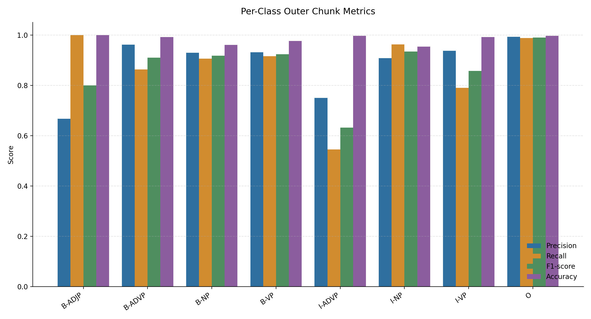
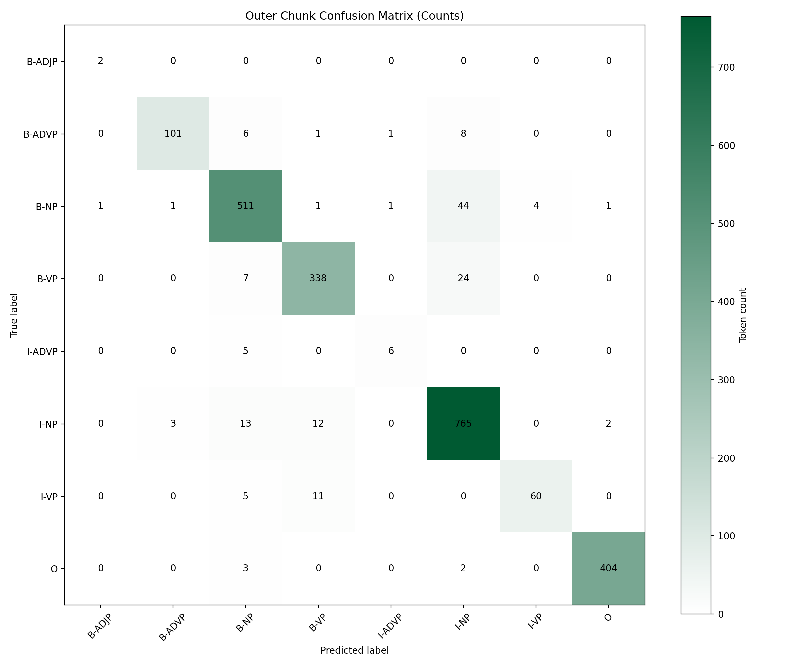
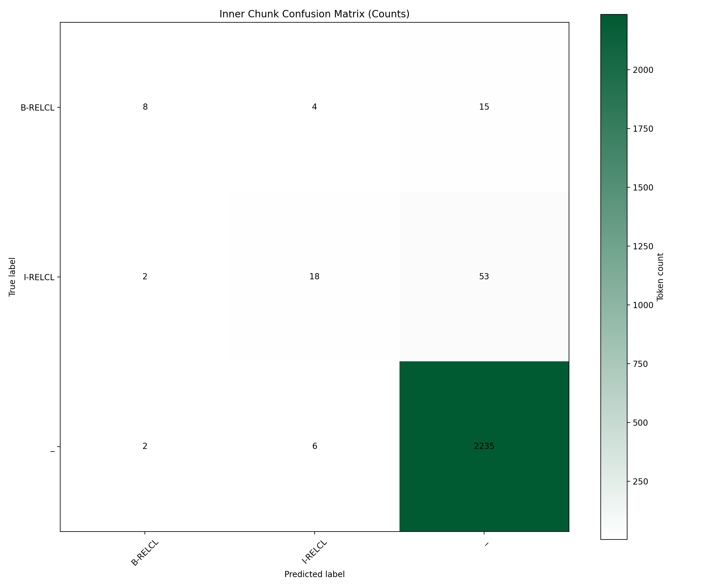
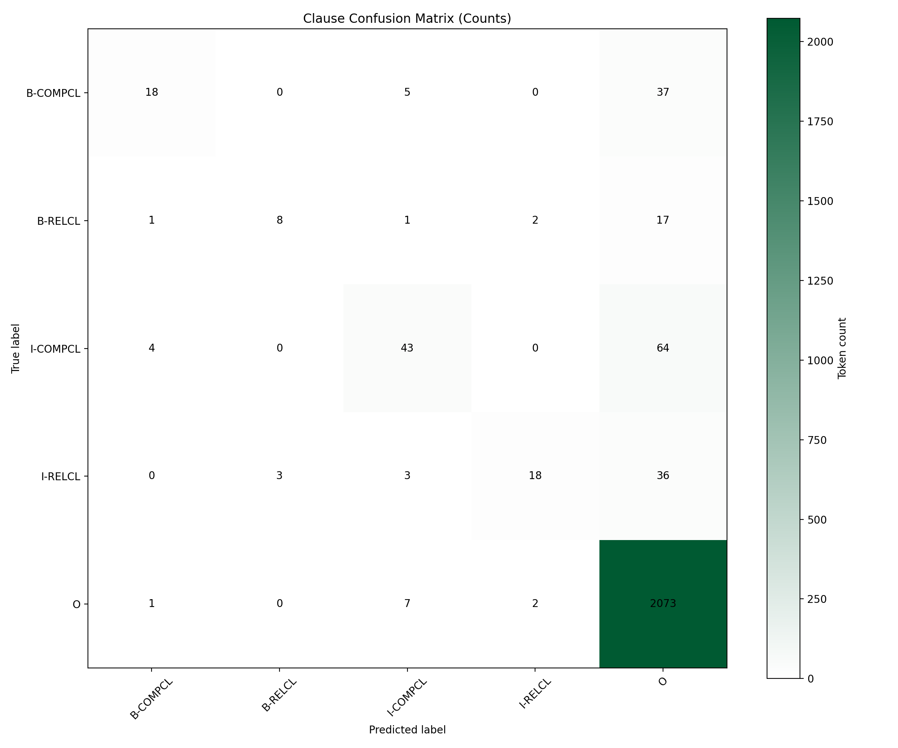
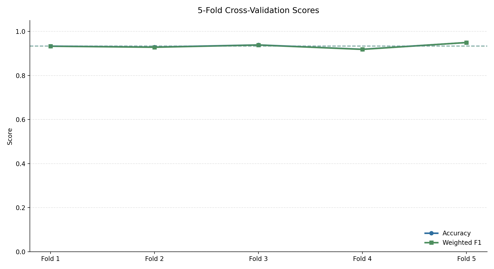
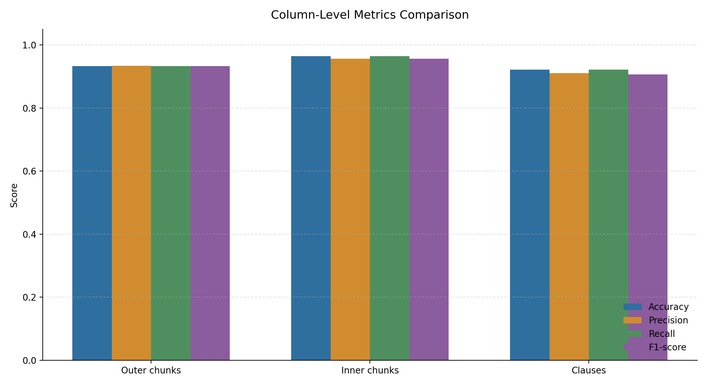

# Türkçe Metinlerde Chunking için CRF Tabanlı Yaklaşım

Ömer Faruk Akyapak 

Bursa Teknik Üniversitesi / Bilgisayar Mühendisliği Yüksek Lisans

## 1. Giriş

Doğal dil işleme çalışmalarında cümlelerin yalnızca tek tek kelimelerden oluşan diziler olarak ele alınması çoğu zaman yeterli değildir. Kelimeler cümle içinde anlamlı sözdizimsel gruplar oluşturur ve bu gruplar daha üst düzey dil işleme görevleri için önemli ipuçları taşır. Chunking, bu grupları tam sözdizimsel ağaç çıkarmadan, yüzeysel olarak belirlemeyi amaçlayan bir sequence labeling problemidir. Bu nedenle tam ayrıştırmaya göre daha sınırlı fakat bilgi çıkarımı, adlandırılmış varlık tanıma, anlamsal rol etiketleme, makine çevirisi ve soru cevaplama gibi görevlerde kullanılabilecek pratik bir ara gösterim sağlar.

Bu çalışmada Türkçe metinlerde isim öbeği (NP), eylem öbeği (VP), zarf öbeği (ADVP) ve sıfat öbeği (ADJP) gibi sözdizimsel öbeklerin otomatik olarak belirlenmesi amaçlanmıştır. Etiketleme B/I/O düzenine dayanmaktadır: `B` etiketi bir öbeğin başladığını, `I` etiketi aynı öbeğin devam ettiğini, `O` etiketi ise tokenın herhangi bir ana öbeğin parçası olmadığını gösterir. Bu temsil, her token için bir sınıf tahmini yapılmasına izin verdiği için chunking görevini makine öğrenmesi modelleriyle çözülebilen bir dizi etiketleme problemine dönüştürür.

Türkçe açısından chunking görevi bazı özel zorluklar taşır. Türkçe eklemeli bir dildir; hal, iyelik, zaman, kip, kişi ve fiilimsi bilgileri çoğu zaman kelime köküne eklenen biçimbirimlerle ifade edilir. Bu durum, bir kelimenin cümledeki sözdizimsel rolünü belirlemede kelime son eklerini önemli hale getirir. Ayrıca Türkçede görece serbest sözcük dizilişi, isim ve eylem öbeklerinin konumunun cümleden cümleye değişebilmesine yol açar. Bu nedenle yalnızca kelime sırasına dayanan basit kurallar yerine, kelime biçimi, ek bilgisi, komşu kelimeler ve ardışık etiket ilişkilerini birlikte değerlendirebilen istatistiksel modellere ihtiyaç duyulur.

Bu proje kapsamında Türkçe cümleler CoNLL formatında işaretlenmiş, `CHUNK-OUTER`, `CHUNK-INNER` ve `CLAUSE` kolonları üzerinden ana öbekler, iç içe yapılar ve yan cümle sınırları temsil edilmiştir. Model olarak Conditional Random Fields (CRF) kullanılmıştır. CRF, ardışık tokenlar arasındaki etiket geçişlerini dikkate aldığı için B/I/O düzenindeki tutarlılığı modelleyebilir ve Türkçe gibi biçimbirimsel ipuçlarının önemli olduğu dillerde özellik tabanlı bir yaklaşım sunar.

## 2. Veri Seti

Veri seti hikaye metinlerinden seçilen 1000 Türkçe cümleden oluşturulmuştur. Toplam 11458 token CoNLL formatında işaretlenmiştir. Her token satırı aşağıdaki kolonlardan oluşmaktadır:

```txt
ID FORM CHUNK-OUTER CHUNK-INNER CLAUSE
```

Veri seti eğitim ve test olmak üzere %80 / %20 oranında ayrılmıştır. Eğitim kümesinde 800 cümle, test kümesinde 200 cümle bulunmaktadır.

Kullanılan ana chunk etiketleri:

- B-NP / I-NP: İsim öbeği
- B-VP / I-VP: Eylem öbeği
- B-ADVP / I-ADVP: Zarf öbeği
- B-ADJP: Sıfat öbeği
- O: Noktalama veya öbek dışı token

Ana chunk etiketlerinin veri setindeki dağılımı aşağıdaki gibidir:

| Etiket | Token Sayısı |
|---|---:|
| B-ADJP | 33 |
| B-ADVP | 602 |
| B-NP | 2757 |
| B-VP | 1764 |
| I-ADVP | 51 |
| I-NP | 3792 |
| I-VP | 296 |
| O | 2163 |

İç içe öbek ve yan cümle bilgisi için ayrıca `CHUNK-INNER` ve `CLAUSE` kolonları kullanılmıştır. Bu kolonlarda göreli yan cümleler `RELCL`, tümleç yan cümleleri ise `COMPCL` etiketleriyle gösterilmiştir.

## 3. Benzer Çalışmalar

Chunking ve genel olarak sequence labeling problemleri için literatürde Hidden Markov Model (HMM), Maximum Entropy Markov Model, Conditional Random Fields (CRF), destek vektör makineleri ve daha yeni çalışmalarda BiLSTM-CRF veya transformer tabanlı modeller kullanılmaktadır. Bu yöntemlerin ortak noktası, cümleyi token dizisi olarak ele alıp her token için bir etiket üretmeleridir. Chunking özelinde amaç, yalnızca tek tek token sınıflarını değil, aynı zamanda öbek sınırlarını da doğru yakalamaktır.

Chunking görevinin standartlaşmasında CoNLL-2000 Shared Task önemli bir dönüm noktasıdır. Tjong Kim Sang ve Buchholz tarafından hazırlanan çalışma, chunking problemini ortak veri, etiketleme şeması ve değerlendirme ölçütleriyle ele almış ve sonraki çalışmalarda yaygın kullanılan bir karşılaştırma zemini oluşturmuştur. CRF’nin sequence labeling alanındaki temel çalışması ise Lafferty, McCallum ve Pereira tarafından önerilen “Conditional Random Fields: Probabilistic Models for Segmenting and Labeling Sequence Data” makalesidir. Bu yaklaşım, gözlem dizisi verildiğinde etiket dizisinin koşullu olasılığını modellediği için özellikle B/I/O gibi ardışık etiket düzenlerinde güçlü bir yöntemdir.

Türkçe üzerine yapılan çalışmalar, dilin eklemeli ve görece serbest sözcük dizilişine sahip yapısının chunking görevini zorlaştırdığını göstermektedir. Yıldız, Solak, Ehsani ve Görgün, “Chunking in Turkish with Conditional Random Fields” çalışmasında Türkçe chunking için CRF tabanlı bir yaklaşım önermiştir. Aslan, Gunal ve Dincer ise “On Constituent Chunking for Turkish” çalışmasında Türkçe constituent chunking için farklı etiketleme şemalarını incelemiş ve F-score değerinin token accuracy’ye göre daha dengeli bir değerlendirme sunduğunu belirtmiştir. Bu tespit, bu projede accuracy yanında precision, recall ve F1-score raporlanmasının gerekçesini desteklemektedir.

Türkçe’de CRF kullanımına ilişkin yakın alan çalışmaları da önemlidir. Şeker ve Eryiğit, Türkçe adlandırılmış varlık tanıma için CRF tabanlı bir model geliştirmiş ve biçimbirimsel bilginin Türkçe gibi zengin morfolojiye sahip dillerde önemini vurgulamıştır. Daha güncel olarak Aras, Makaroğlu, Demir ve Cakir, Türkçe NER için BiLSTM ve transformer tabanlı sequence tagging modellerini değerlendirmiş; CRF katmanının neural modeller üzerinde de yararlı bir üst katman olarak kullanılabildiğini göstermiştir. Bu çalışmalar, CRF’nin hem klasik özellik tabanlı modellerde hem de modern neural yapılarda sequence labeling için geçerliliğini koruduğunu göstermektedir.

Bu proje, yukarıdaki literatür doğrultusunda Türkçe chunking görevini CoNLL benzeri B/I/O etiketleme düzeniyle ele almakta ve açıklanabilir özelliklere dayanan CRF modeli kullanmaktadır. Amaç, büyük ölçekli derin öğrenme modeli kurmak yerine, sınırlı ve elle kontrol edilebilir bir veri seti üzerinde çalışır, değerlendirilebilir ve raporlanabilir bir istatistiksel chunking sistemi oluşturmaktır.

Kullanılan ve ilişkili çalışmalar:

| Çalışma | DOI |
|---|---|
| Lafferty, McCallum ve Pereira, “Conditional Random Fields: Probabilistic Models for Segmenting and Labeling Sequence Data” | 10.5555/645530.655813 |
| Tjong Kim Sang ve Buchholz, “Introduction to the CoNLL-2000 Shared Task: Chunking” | 10.3115/1117601.1117631 |
| Yıldız, Solak, Ehsani ve Görgün, “Chunking in Turkish with Conditional Random Fields” | 10.1007/978-3-319-18111-0_14 |
| Aslan, Gunal ve Dincer, “On Constituent Chunking for Turkish” | 10.1016/j.ipm.2018.05.004 |
| Şeker ve Eryiğit, “Extending a CRF-based Named Entity Recognition Model for Turkish Well Formed Text and User Generated Content” | 10.3233/SW-170253 |
| Aras, Makaroğlu, Demir ve Cakir, “An Evaluation of Recent Neural Sequence Tagging Models in Turkish Named Entity Recognition” | 10.1016/j.eswa.2021.115049 |

## 4. Yöntem

Bu projede sequence labeling problemi için Conditional Random Fields (CRF) modeli kullanılmıştır. CRF, verilen bir gözlem dizisi `x` için en olası etiket dizisini `y` tahmin etmeye çalışan ayrımcı bir olasılıksal modeldir. Başka bir ifadeyle model, `P(y|x)` koşullu olasılığını öğrenir. Burada `x` cümledeki tokenlardan ve bu tokenlardan çıkarılan özelliklerden, `y` ise her tokena karşılık gelen chunk etiketlerinden oluşur.

CRF’nin chunking için uygun olmasının temel nedeni, tahminleri birbirinden bağımsız token sınıflandırmaları olarak ele almamasıdır. Model, bir tokenın hangi etiketi alacağını hesaplarken hem o tokena ait gözlem özelliklerini hem de önceki/sonraki etiketlerle olan geçiş ilişkilerini dikkate alır. Örneğin `B-NP` etiketinden sonra `I-NP` gelmesi doğal bir geçişken, `B-VP` etiketinden sonra `I-NP` gelmesi çoğu durumda daha zayıf bir geçiş olabilir. Bu yapı, B/I/O düzeninde öbek sınırlarının daha tutarlı öğrenilmesini sağlar.

Modelde iki tür bilgi birlikte kullanılır. İlk grup, tokenın kendisinden ve yakın çevresinden çıkarılan gözlem özellikleridir. Kelimenin küçük harfli biçimi, ön ek ve son ekleri, büyük harfle başlayıp başlamadığı, sayı olup olmadığı, önceki ve sonraki kelime bilgisi bu gruba girer. İkinci grup ise etiket geçişleridir. CRF, eğitim sırasında hangi etiketlerin birbirini takip etmeye daha yatkın olduğunu öğrenerek tahmin aşamasında tüm cümle için en olası etiket dizisini seçer.

Her token için kullanılan bazı özellikler:

- Kelimenin küçük harfli biçimi
- Kelimenin son 1, 2 ve 3 karakteri
- Kelimenin ilk 1 ve 2 karakteri
- Büyük harfle başlayıp başlamadığı
- Sayı olup olmadığı
- Önceki kelime bilgisi
- Sonraki kelime bilgisi

Bu özelliklerin seçilmesinin nedeni Türkçe’nin biçimbirimsel yapısıyla ilişkilidir. Türkçe’de kelime son ekleri hal, iyelik, fiilimsi, zaman ve kişi gibi sözdizimsel açıdan önemli bilgileri taşıyabilir. Bu nedenle son 1, 2 ve 3 karakter gibi son ek benzeri yüzeysel özellikler model için yararlı ipuçları sağlar. Önceki ve sonraki kelime bilgisi ise bir tokenın içinde bulunduğu yerel bağlamı temsil eder; bu da özellikle öbek sınırlarının belirlenmesinde önemlidir.

Projede `CHUNK-OUTER`, `CHUNK-INNER` ve `CLAUSE` kolonları için ayrı CRF modelleri eğitilmiştir. `CHUNK-OUTER` modeli ana öbek etiketlerini, `CHUNK-INNER` modeli iç içe göreli öbekleri, `CLAUSE` modeli ise yan cümle sınırlarını tahmin eder. Bu tercih, üç kolonun farklı etiket kümelerine ve farklı dağılımlara sahip olmasından kaynaklanır. Ayrı modeller kullanılarak her görev kendi etiket uzayı içinde öğrenilmiş, tahmin aşamasında ise üç modelin çıktıları aynı CoNLL satırında birleştirilmiştir.

Eğitim aşamasında cümleler token dizilerine dönüştürülmüş, her token için özellik sözlüğü çıkarılmış ve ilgili kolonun etiket dizisi hedef çıktı olarak kullanılmıştır. Tahmin aşamasında yeni bir cümle önce tokenize edilmekte, aynı özellik çıkarım sürecinden geçirilmekte ve eğitilen CRF modelleri tarafından `CHUNK-OUTER`, `CHUNK-INNER` ve `CLAUSE` etiketleri üretilmektedir.

## 5. Deneysel Kurulum

Veri seti `random_state=42` ile eğitim ve test kümelerine ayrılmıştır. Model başarısı hem sabit test kümesi üzerinde hem de 5-fold cross-validation ile ölçülmüştür.

Çalıştırma sırası:

```txt
python src/annotate_chunking.py
python src/prepare_dataset.py
python src/train_crf.py
python src/cross_validate.py
python src/plot_results.py
```

## 6. Değerlendirme Metrikleri

Model başarısı token seviyesinde değerlendirilmiştir. Yani test kümesindeki her token için modelin ürettiği etiket, gerçek etiketle karşılaştırılmıştır. Chunking görevinde yalnızca genel doğru tahmin oranına bakmak yeterli değildir; çünkü bazı etiketler veri setinde çok sık, bazıları ise oldukça az görülmektedir. Bu nedenle accuracy ile birlikte precision, recall, F1-score ve confusion matrix kullanılmıştır.

Accuracy, tüm tokenlar içinde doğru etiketlenen token oranını gösterir. Genel performansı hızlı özetlemek için yararlıdır. Ancak veri dengesiz olduğunda tek başına yanıltıcı olabilir. Örneğin çok sık görülen `O` veya `_` gibi etiketlerde yüksek başarı, az görülen sınıflardaki hataları gizleyebilir.

Precision, modelin belirli bir etiketi verdiği durumlarda ne kadar doğru olduğunu ölçer. Örneğin modelin `B-NP` olarak tahmin ettiği tokenların ne kadarının gerçekten `B-NP` olduğunu gösterir. Precision değerinin düşük olması, modelin ilgili etiketi gereğinden fazla kullandığını ve yanlış pozitif ürettiğini gösterir.

Recall, gerçek etiketi belirli bir sınıf olan tokenların ne kadarının model tarafından yakalandığını ölçer. Örneğin gerçek `I-ADVP` tokenlarının ne kadarının model tarafından `I-ADVP` olarak tahmin edildiğini gösterir. Recall değerinin düşük olması, modelin ilgili sınıfa ait örnekleri kaçırdığını gösterir.

F1-score, precision ve recall değerlerinin harmonik ortalamasıdır. Bu metrik, özellikle sınıf dağılımı dengesiz olduğunda daha dengeli bir başarı ölçüsü sağlar. Chunking görevinde hem yanlış etiket üretmek hem de gerçek öbekleri kaçırmak önemli olduğu için F1-score temel değerlendirme ölçütlerinden biri olarak kullanılmıştır.

Weighted precision, weighted recall ve weighted F1 değerleri, her sınıfın destek sayısı dikkate alınarak hesaplanmıştır. Bu nedenle veri setinde daha çok görülen sınıflar genel ortalamaya daha fazla etki eder. Bu projede weighted ortalamalar, modelin genel token seviyesindeki davranışını özetlemek için kullanılmış; sınıf bazlı tablo ise az görülen etiketlerdeki performansı ayrıca incelemek için verilmiştir.

Sınıf bazlı accuracy değeri one-vs-rest yaklaşımla `(TP + TN) / tüm test token sayısı` olarak hesaplanmıştır. Burada ilgili etiket pozitif sınıf, diğer tüm etiketler negatif sınıf kabul edilmiştir. Böylece her etiket için modelin o etiketi ayırt etme başarısı ayrıca raporlanmıştır.

Confusion matrix, gerçek etiketler ile tahmin edilen etiketlerin çapraz tablosunu gösterir. Bu grafik, modelin hangi etiketleri birbiriyle karıştırdığını görmeyi sağlar. Örneğin `B-NP` ile `I-NP` arasındaki karışıklıklar öbek başlangıcı/devamı sınırlarında hata yapıldığını, `B-VP` ile `I-VP` arasındaki karışıklıklar ise eylem öbeği sınırlarının zorlandığını gösterebilir.

Cross-validation, modelin yalnızca tek bir eğitim-test ayrımına bağlı kalmadan değerlendirilmesi için kullanılmıştır. 5-fold cross-validation ile veri beş farklı parçaya bölünmüş, her fold içinde farklı bir test bölmesi kullanılmıştır. Fold sonuçlarının birbirine yakın olması, modelin veri bölünmesine aşırı duyarlı olmadığını ve daha kararlı bir genelleme performansı verdiğini gösterir.

## 7. Sonuçlar

Test kümesi üzerinde elde edilen genel sonuçlar aşağıdaki gibidir:

| Kolon | Accuracy | Weighted Precision | Weighted Recall | Weighted F1 |
|---|---:|---:|---:|---:|
| CHUNK-OUTER | 0.9334 | 0.9340 | 0.9334 | 0.9330 |
| CHUNK-INNER | 0.9650 | 0.9568 | 0.9650 | 0.9571 |
| CLAUSE | 0.9219 | 0.9112 | 0.9219 | 0.9063 |

Bu sonuçlar, modelin ana chunk etiketleri üzerinde yüksek ve dengeli bir başarı verdiğini göstermektedir. `CHUNK-OUTER` kolonunda accuracy ve weighted F1 değerlerinin birbirine çok yakın olması, modelin yalnızca çoğunluk sınıflarına yaslanmadığını, genel olarak precision ve recall dengesini de koruduğunu göstermektedir. Ana chunking görevi için 0.9330 weighted F1 değeri, CRF modelinin isim, eylem ve zarf öbeklerini token seviyesinde başarılı biçimde ayırt edebildiğini göstermektedir.

`CHUNK-INNER` kolonunda accuracy değeri 0.9650 ile en yüksek değerdir. Ancak bu sonuç yorumlanırken sınıf dağılımı dikkate alınmalıdır; çünkü bu kolonda `_` etiketi baskındır. Bu nedenle yüksek accuracy, modelin iç içe öbek bulunmayan tokenları büyük ölçüde doğru ayırt ettiğini gösterirken, az görülen `RELCL` etiketleri için recall ve F1-score değerlerinin ayrıca incelenmesi gerekir.

`CLAUSE` kolonunda weighted F1 değeri 0.9063 ile diğer kolonlara göre daha düşüktür. Bu durum beklenen bir sonuçtur; çünkü yan cümle sınırlarını belirlemek, ana öbekleri belirlemeye göre daha karmaşık bir görevdir. Özellikle tümleç yan cümlesi ve göreli yan cümle sınırları, tek bir tokenın biçiminden çok cümlenin daha geniş bağlamına bağlı olabilir.

5-fold cross-validation ortalamaları:

| Kolon | Accuracy | Weighted Precision | Weighted Recall | Weighted F1 |
|---|---:|---:|---:|---:|
| CHUNK-OUTER | 0.9341 | 0.9348 | 0.9341 | 0.9336 |
| CHUNK-INNER | 0.9721 | 0.9667 | 0.9721 | 0.9655 |
| CLAUSE | 0.9402 | 0.9323 | 0.9402 | 0.9287 |

Cross-validation sonuçları, modelin tek bir train-test ayrımına bağlı kalmadığını göstermektedir. `CHUNK-OUTER` için 5-fold weighted F1 ortalamasının 0.9336 olması, sabit test kümesindeki 0.9330 değeriyle oldukça uyumludur. Bu yakınlık, modelin farklı veri bölmelerinde benzer performans verdiğini ve sonuçların rastgele veri ayrımına aşırı duyarlı olmadığını göstermektedir.

Kolonlar karşılaştırıldığında `CHUNK-INNER` için cross-validation accuracy değeri en yüksek görünmektedir. Bunun temel nedeni, iç içe öbek bulunmayan tokenların veri setinde çok daha fazla olmasıdır. `CLAUSE` kolonunda cross-validation weighted F1 değerinin 0.9287 olması, sabit test kümesine göre daha yüksek bir ortalama üretmiştir; bu da yan cümle etiketlerinin bazı foldlarda daha dengeli dağılmış olabileceğini göstermektedir.

Ana chunk etiketleri için sınıf bazlı sonuçlar:

| Etiket | Precision | Recall | F1-score | Accuracy | Support |
|---|---:|---:|---:|---:|---:|
| B-ADJP | 0.6667 | 1.0000 | 0.8000 | 0.9996 | 2 |
| B-ADVP | 0.9619 | 0.8632 | 0.9099 | 0.9915 | 117 |
| B-NP | 0.9291 | 0.9060 | 0.9174 | 0.9607 | 564 |
| B-VP | 0.9311 | 0.9160 | 0.9235 | 0.9761 | 369 |
| I-ADVP | 0.7500 | 0.5455 | 0.6316 | 0.9970 | 11 |
| I-NP | 0.9075 | 0.9623 | 0.9341 | 0.9539 | 795 |
| I-VP | 0.9375 | 0.7895 | 0.8571 | 0.9915 | 76 |
| O | 0.9926 | 0.9878 | 0.9902 | 0.9966 | 409 |

Sınıf bazlı sonuçlar, modelin sık görülen ana etiketlerde daha kararlı olduğunu göstermektedir. `I-NP` etiketi 795 destek sayısıyla test kümesindeki en sık etiketlerden biridir ve 0.9341 F1-score değerine ulaşmıştır. Bu sonuç, modelin devam eden isim öbeklerini büyük ölçüde doğru yakaladığını göstermektedir. `B-NP` için 0.9174 F1-score değeri de isim öbeği başlangıçlarının genel olarak başarılı biçimde belirlendiğini göstermektedir.

`B-VP` ve `I-VP` etiketleri eylem öbekleri açısından değerlendirildiğinde, `B-VP` için F1-score 0.9235 iken `I-VP` için 0.8571'dir. Bu fark, eylem öbeği başlangıçlarının devam etiketlerine göre daha kolay öğrenildiğini düşündürmektedir. Eylem öbeklerinde yardımcı fiil, fiilimsi veya birleşik yapıların görülmesi, devam etiketlerinin daha zor tahmin edilmesine yol açabilir.

`O` etiketi 0.9902 F1-score ile en güçlü sınıflardan biridir. Bu durum, noktalama veya öbek dışı tokenların model tarafından yüksek doğrulukla ayırt edildiğini göstermektedir. Buna karşılık `I-ADVP` etiketi 0.6316 F1-score ile en zayıf sınıflardan biridir. Test kümesinde yalnızca 11 örnek bulunması, bu sınıfın öğrenilmesini ve güvenilir biçimde değerlendirilmesini zorlaştırmaktadır. `B-ADJP` için F1-score 0.8000 görünse de destek sayısı yalnızca 2 olduğu için bu değer genelleme başarısı hakkında sınırlı bilgi verir.

### Grafikler

Ana chunk sınıfları için precision, recall, F1-score ve sınıf bazlı accuracy değerleri `results/per_class_metrics.png` dosyasında gösterilmiştir. Grafik, sık görülen `B-NP`, `I-NP`, `B-VP` ve `O` etiketlerinde modelin daha kararlı olduğunu; az örnekli `I-ADVP` ve `B-ADJP` etiketlerinde sonuçların destek sayısından daha fazla etkilendiğini göstermektedir.



```txt
results/per_class_metrics.png
```

Ana chunk etiketleri için karışıklık matrisi `results/confusion_matrix.png` dosyasında verilmiştir. Bu grafik, modelin özellikle benzer B/I geçişlerinde ve NP/VP sınırlarında yaptığı hataları incelemek için kullanılmıştır.



```txt
results/confusion_matrix.png
```

İç içe öbek etiketleri için karışıklık matrisi:



```txt
results/confusion_matrix_inner.png
```

Yan cümle etiketleri için karışıklık matrisi:



```txt
results/confusion_matrix_clause.png
```

5-fold cross-validation boyunca accuracy ve weighted F1 değerlerinin değişimi `results/cross_validation_scores.png` dosyasında gösterilmiştir. Fold sonuçlarının birbirine yakın olması modelin farklı veri bölmelerinde benzer performans verdiğini göstermektedir.



```txt
results/cross_validation_scores.png
```

`CHUNK-OUTER`, `CHUNK-INNER` ve `CLAUSE` kolonlarının genel performans karşılaştırması `results/column_metrics_comparison.png` dosyasında verilmiştir. En yüksek accuracy `CHUNK-INNER` kolonunda görülmektedir; bunun temel nedeni bu kolonda `_` etiketinin veri içinde baskın olmasıdır. `CLAUSE` kolonunda recall ve F1 değerlerinin daha düşük kalması, yan cümle sınırlarının ana chunk etiketlerine göre daha zor öğrenildiğini göstermektedir.



```txt
results/column_metrics_comparison.png
```

Genel olarak grafikler ve tablolar birlikte değerlendirildiğinde, CRF modelinin ana chunking görevinde güçlü bir temel performans verdiği görülmektedir. En belirgin zayıflıklar, destek sayısı düşük sınıflarda ve daha karmaşık yapısal sınırlar gerektiren `CLAUSE` etiketlerinde ortaya çıkmaktadır. Bu nedenle ileride veri seti genişletilirse özellikle `ADJP`, `ADVP` devam etiketleri ve yan cümle sınıflarının daha dengeli temsil edilmesi model başarısını artırabilir.

## 8. Tartışma

Elde edilen sonuçlar, CRF tabanlı yaklaşımın Türkçe chunking görevi için güçlü ve açıklanabilir bir temel sunduğunu göstermektedir. Ana chunk etiketleri için 0.9330 weighted F1-score elde edilmesi, modelin isim, eylem ve zarf öbeklerini genel olarak başarılı biçimde ayırt edebildiğini göstermektedir. Ayrıca 5-fold cross-validation sonucunda `CHUNK-OUTER` için 0.9336 weighted F1-score elde edilmesi, model performansının tek bir veri bölünmesine bağlı olmadığını desteklemektedir.

Modelin güçlü olduğu sınıflar çoğunlukla veri setinde daha fazla temsil edilen sınıflardır. `I-NP`, `B-NP`, `B-VP` ve `O` etiketlerinde elde edilen yüksek F1-score değerleri, CRF’nin hem token özelliklerinden hem de ardışık etiket geçişlerinden etkili biçimde yararlandığını göstermektedir. Özellikle isim öbeklerinde başlangıç ve devam etiketlerinin yüksek başarıyla tahmin edilmesi, B/I/O düzeninin CRF tarafından tutarlı biçimde öğrenilebildiğine işaret etmektedir.

Buna karşılık düşük destekli sınıflarda performans daha değişkendir. `I-ADVP` etiketinde recall değerinin 0.5455 olması, modelin zarf öbeği devam tokenlarını her zaman yakalayamadığını göstermektedir. `B-ADJP` sınıfında F1-score değeri 0.8000 görünse de test kümesinde yalnızca 2 örnek bulunduğu için bu sonuç genelleme açısından sınırlı yorumlanmalıdır. Bu durum, veri setindeki sınıf dağılımının model değerlendirmesi üzerinde önemli etkisi olduğunu göstermektedir.

`CHUNK-INNER` ve `CLAUSE` kolonları, ana chunk etiketlerine göre daha dikkatli yorumlanmalıdır. `CHUNK-INNER` kolonunda yüksek accuracy elde edilmesine rağmen `_` etiketinin baskın olması bu değeri yükseltmektedir. `CLAUSE` kolonunda daha düşük F1-score görülmesi ise yan cümle sınırlarının yalnızca yerel kelime özellikleriyle değil, daha geniş sözdizimsel bağlamla ilişkili olduğunu göstermektedir. Bu nedenle yan cümle ve iç içe öbek etiketleri için daha dengeli ve daha fazla örnek içeren bir veri seti model başarısını artırabilir.

Bu çalışmanın bir diğer sınırlılığı, veri işaretlemesinin proje kapsamında oluşturulan sınırlı bir veri setine dayanmasıdır. Daha büyük ve elle doğrulanmış bir Türkçe chunking derlemi kullanılması, özellikle az görülen `ADJP`, `ADVP` ve yan cümle etiketlerinde daha güvenilir sonuçlar sağlayabilir. Ayrıca kelime kökü, biçimbirimsel çözümleme, sözcük türü etiketi ve bağımlılık ilişkileri gibi ek dilbilgisel özelliklerin modele dahil edilmesi Türkçe’nin eklemeli yapısından kaynaklanan belirsizlikleri azaltabilir.

Gelecek çalışmalar için iki yön öne çıkmaktadır. İlk olarak, veri setindeki sınıf dengesizliği azaltılarak az görülen etiketlerin daha iyi temsil edilmesi sağlanabilir. İkinci olarak, CRF modeli morfolojik çözümleyici veya BiLSTM-CRF gibi neural sequence tagging yaklaşımlarıyla karşılaştırılabilir. Böylece klasik özellik tabanlı CRF yaklaşımının Türkçe chunking görevindeki yeri daha kapsamlı biçimde değerlendirilebilir.

## 9. Çıkarım

Bu çalışmada Türkçe metinlerde chunking görevi için CRF tabanlı bir sequence labeling sistemi geliştirilmiştir. Proje kapsamında 1000 cümle ve 11458 tokendan oluşan veri seti CoNLL formatında işaretlenmiş; `CHUNK-OUTER`, `CHUNK-INNER` ve `CLAUSE` kolonları üzerinden ana öbekler, iç içe yapılar ve yan cümle sınırları modellenmiştir. Eğitim ve test işlemleri %80 / %20 ayrımıyla yapılmış, ayrıca 5-fold cross-validation ile modelin genelleme başarısı ölçülmüştür.

Ana chunking görevi için test kümesinde 0.9334 accuracy ve 0.9330 weighted F1-score elde edilmiştir. 5-fold cross-validation ortalamasında ise `CHUNK-OUTER` için 0.9341 accuracy ve 0.9336 weighted F1-score görülmüştür. Bu değerler, CRF modelinin Türkçe sözdizimsel öbekleme görevinde güçlü bir temel performans verdiğini göstermektedir. `CHUNK-INNER` ve `CLAUSE` kolonları için elde edilen sonuçlar da sistemin yalnızca ana chunk etiketlerini değil, iç içe ve yan cümle yapılarını da belirli ölçüde modelleyebildiğini göstermektedir.

Sonuç olarak, bu proje klasik istatistiksel makine öğrenmesi yöntemlerinden CRF’nin Türkçe chunking için uygulanabilir olduğunu göstermiştir. Modelin en güçlü tarafı, B/I/O etiket geçişlerini kullanarak ana öbek sınırlarını tutarlı biçimde öğrenebilmesidir. En belirgin geliştirme alanı ise az örnekli sınıflar ve daha karmaşık yan cümle yapılarıdır. Daha dengeli ve daha geniş bir veri seti, morfolojik özellikler ve farklı sequence labeling modelleriyle yapılacak karşılaştırmalar, çalışmanın ileride geliştirilebilecek yönlerini oluşturmaktadır.
